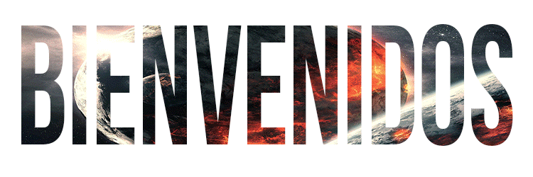

SOY( )

var

Descripcion= 

'Soy una persona proactiva, me gustan los desafíos y participar en nuevos proyectospara mi, además de aportar todos los conocimientos que he adquirido en mi formación académica. Tengo capacidad para trabajar en equipo e impulsar valores que marquen a las personas como el del compañerismo y la amistad.'

var

Portafolio= 

'en construcción.'

VIDEOGAME HENRY PI

<video controls width="50%" autoplay loop src='VideoGamePI.mp4' type='video.mp4'></video>

🕹️ Videogames App:puedes ver distintos videojuegos con su información utilizando la API RAWG.

En el Front-End utilicé React, Redux y todos los componentes fueron desarrollados con CSS puro. En el Back-End consumí la API de RAWG utilizando Node.JS y Express. Además utilice PostgreSQL para poder que el usuario pueda crear su propio videojuego.

🟢 Input de búsqueda de videojuegos por nombre
🟢 Ordenamientos y filtros
🟢 Formulario controlado para crear un videojuego
🟢 Pagina para ver los detalles del videojuego

var

Repositorio= 
<a href='https://github.com/SacZ16/PI-Videogames-FT-13'>
'Click aqui para ir'
</a>

POKEMON HENRY PI

<video controls width="50%" autoplay loop src='PokemonPI.mp4' type='video.mp4'></video>

🎮 Pokemon App:puedes ver 40 pokemones y buscar entre los 1118 existentes con su información utilizando la API pokeapi.

En el Front-End utilicé React, Redux y todos los componentes fueron desarrollados con CSS puro. En el Back-End consumí la API de pokeapi utilizando Node.JS y Express. Además utilice PostgreSQL para poder que el usuario pueda agregar su propio pokemon.

🟢 Input de búsqueda de pokemon's por nombre
🟢 Ordenamientos y filtros
🟢 Formulario controlado para agregar un pokemon
🟢 Pagina para ver los detalles del pokemon

var

Repositorio= 
<a href='https://github.com/SacZ16/PI-Pokemon-FT-14a'>
'Click aqui para ir'
</a>

 

💮🖥💻Programando mas proyectos y ansioso de poder trabajar en equipo🖥💻💮

 

──
▒▒▒▒▒▒
───
▒▒▒▒▒▒
───
▒▒▒▒▒▒
───
▒▒▒▒▒▒
────
▄████▄

─
▒─▄▒─▄▒──
▒─▄▒─▄▒──
▒─▄▒─▄▒
──
▒─▄▒─▄▒
───
███▄█▀

─
▒▒▒▒▒▒▒
──
▒▒▒▒▒▒▒
──
▒▒▒▒▒▒▒
──
▒▒▒▒▒▒▒
──
▐████
──
█
─
█

─
▒▒▒▒▒▒▒
──
▒▒▒▒▒▒▒
──
▒▒▒▒▒▒▒
──
▒▒▒▒▒▒▒
───
█████▄

─
▒─▒─▒─▒
──
▒─▒─▒─▒
──
▒─▒─▒─▒
──
▒─▒─▒─▒
────
▀████▀

