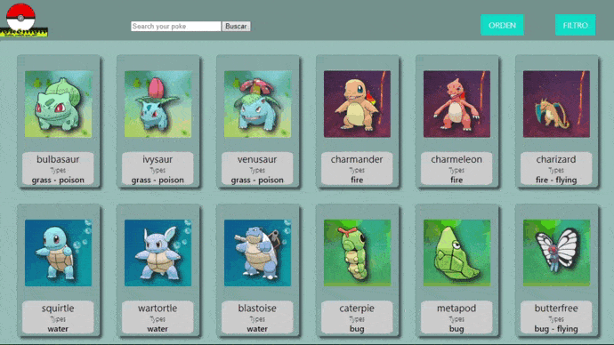

  

  <h3>Tech:</h3>

const AlexisCoronel=()=>{

const descripcion= 'Soy una persona proactiva, me gustan los desafíos y participar en nuevos proyectos, además de aportar todos los conocimientos que he adquirido en mi formación académica. Tengo capacidad para trabajar en equipo e impulsar valores que marquen a las personas como el del compañerismo y la amistad.'

const portafolio= <a href='https://sacz16.github.io/Portafolio/'target="_blank">'Click aqui para ir'</a>

  
const correo= 'alexiscoronel545@gmail.com'

  
const linkedin= <a href='https://www.linkedin.com/in/alexis-coronel/'target="_blank">'Click aqui para ir'</a>

  
TEKAL GAME

🕹️ Tekal Memory Game:Colaboré en el desarrollo de un juego web que predice el impacto cognitivo de ciertos videos e imágenes, midiendo la memorabilidad de los mismos, tanto a corto como a largo plazo.
En particular, me desenvolví en el área de Front-end,css, donde tuve que hacer un responsive para todos los dispositivos, incluido los celulares horizontalmente, También se agrego un efecto parallax, pop up de login,resgister,tutorial y aviso de juego terminado, todo eso con css puro, además de participar en los componentes de React.js
 El equipo se manejaba con las metodologías agiles de SCRUM.Stand-up meeting diarios junto al Tech Lead y cada dos dias con el Tech Lead y la empresa

const repositorio= <a href='https://github.com/SacZ16/Tekal.Game' target="_blank">'Click aqui para ir'</a>

VIDEOGAME APP

🕹️ Videogames App:puedes ver distintos videojuegos con su información utilizando la API RAWG.

En el Front-End utilicé React, Redux y todos los componentes fueron desarrollados con CSS puro. En el Back-End consumí la API de RAWG utilizando Node.JS y Express. Además utilice PostgreSQL para poder que el usuario pueda crear su propio videojuego.

🟢 Input de búsqueda de videojuegos por nombre 
🟢 Ordenamientos y filtros 
🟢 Formulario controlado para crear un videojuego
 🟢 Pagina para ver los detalles del videojuego

var repositorio= <a href='https://github.com/SacZ16/Pokemon-App'target="_blank">'Click aqui para ir'</a>

POKEMON APP

🎮 Pokemon App:puedes ver 40 pokemones y buscar entre los 1118 existentes con su información utilizando la API pokeapi.

En el Front-End utilicé React, Redux y todos los componentes fueron desarrollados con CSS puro. En el Back-End consumí la API de pokeapi utilizando Node.JS y Express. Además utilice PostgreSQL para poder que el usuario pueda agregar su propio pokemon.

🟢 Input de búsqueda de pokemon's por nombre
🟢 Ordenamientos y filtros
🟢 Formulario controlado para agregar un pokemon
🟢 Pagina para ver los detalles del pokemon

const repositorio= <a href='https://github.com/SacZ16/Pokemon-App'target="_blank">'Click aqui para ir'</a>

 

💮🖥💻Programando mas proyectos y ansioso de poder trabajar en equipo🖥💻💮

 
  
}

 ──▒▒▒▒▒▒───▒▒▒▒▒▒───▒▒▒▒▒▒───▒▒▒▒▒▒────▄████▄

 ─▒─▄▒─▄▒──▒─▄▒─▄▒──▒─▄▒─▄▒──▒─▄▒─▄▒───███▄█▀

 ─▒▒▒▒▒▒▒──▒▒▒▒▒▒▒──▒▒▒▒▒▒▒──▒▒▒▒▒▒▒──▐████──█─█

 ─▒▒▒▒▒▒▒──▒▒▒▒▒▒▒──▒▒▒▒▒▒▒──▒▒▒▒▒▒▒───█████▄

 ─▒─▒─▒─▒──▒─▒─▒─▒──▒─▒─▒─▒──▒─▒─▒─▒────▀████▀

