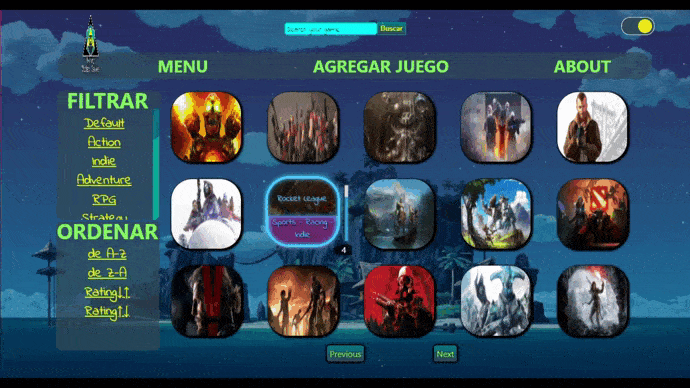

SOY( )

var descripcion= 'Soy una persona proactiva, me gustan los desafíos y participar en nuevos proyectospara mi, además de aportar todos los conocimientos que he adquirido en mi formación académica. Tengo capacidad para trabajar en equipo e impulsar valores que marquen a las personas como el del compañerismo y la amistad.'

var portafolio= <a href='https://sacz16.github.io/Portafolio/'target="_blank">'Click aqui para ir'</a>

  
var whatsapp= '+543541679878'

  
var correo= 'alexiscoronel545@gmail.com'

  
var linkedin= <a href='https://www.linkedin.com/in/alexis-coronel/'target="_blank">'Click aqui para ir'</a>

  
var localidad='Argentina - Cordoba'

VIDEOGAME APP

🕹️ Videogames App:puedes ver distintos videojuegos con su información utilizando la API RAWG.

En el Front-End utilicé React, Redux y todos los componentes fueron desarrollados con CSS puro. En el Back-End consumí la API de RAWG utilizando Node.JS y Express. Además utilice PostgreSQL para poder que el usuario pueda crear su propio videojuego.

🟢 Input de búsqueda de videojuegos por nombre
🟢 Ordenamientos y filtros
🟢 Formulario controlado para crear un videojuego
🟢 Pagina para ver los detalles del videojuego

var repositorio= <a href='https://github.com/SacZ16/Videogames-App' target="_blank">'Click aqui para ir'</a>

POKEMON APP

🮠Pokemon App:puedes ver 40 pokemones y buscar entre los 1118 existentes con su información utilizando la API pokeapi.

En el Front-End utilicé React, Redux y todos los componentes fueron desarrollados con CSS puro. En el Back-End consumí la API de pokeapi utilizando Node.JS y Express. Además utilice PostgreSQL para poder que el usuario pueda agregar su propio pokemon.

🟢 Input de búsqueda de pokemon's por nombre
🟢 Ordenamientos y filtros
🟢 Formulario controlado para agregar un pokemon
🟢 Pagina para ver los detalles del pokemon

var repositorio= <a href='https://github.com/SacZ16/Pokemon-App'target="_blank">'Click aqui para ir'</a>

 

💮🖥💻Programando mas proyectos y ansioso de poder trabajar en equipo🖥💻💮

 

 ──▒▒▒▒▒▒───▒▒▒▒▒▒───▒▒▒▒▒▒───▒▒▒▒▒▒────▄████▄

 ─▒─▄▒─▄▒──▒─▄▒─▄▒──▒─▄▒─▄▒──▒─▄▒─▄▒───███▄█▀

 ─▒▒▒▒▒▒▒──▒▒▒▒▒▒▒──▒▒▒▒▒▒▒──▒▒▒▒▒▒▒──▐████──█─█

 ─▒▒▒▒▒▒▒──▒▒▒▒▒▒▒──▒▒▒▒▒▒▒──▒▒▒▒▒▒▒───█████▄

 ─▒─▒─▒─▒──▒─▒─▒─▒──▒─▒─▒─▒──▒─▒─▒─▒────▀████▀

